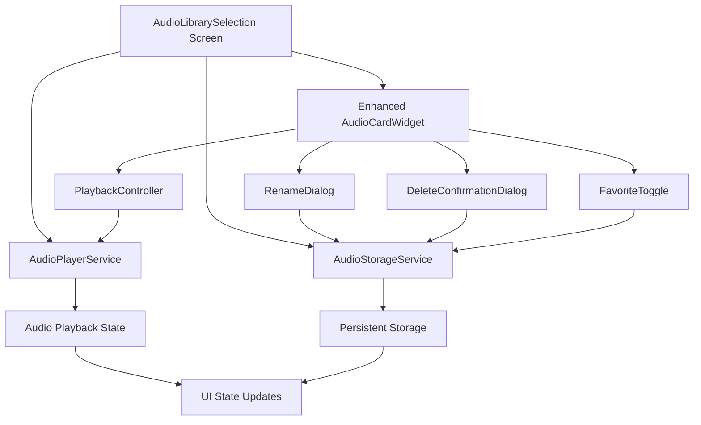

# Design Document

## Overview

This design document outlines the enhancement of the audio selection functionality in the Good Deeds Reminder Flutter app. The enhancement focuses on making the four action icons in each audio card fully functional: play/pause, rename, favorite, and delete. The design leverages the existing audio services architecture while adding new interaction patterns and UI feedback mechanisms.

The solution builds upon the current `AudioLibrarySelection` screen and `AudioCardWidget`, enhancing them with complete CRUD operations, audio preview capabilities, and improved user experience through visual feedback and state management.

## Architecture

### High-Level Architecture



### Component Interaction Flow

1. **Audio Selection Screen** serves as the main container managing overall state
2. **Enhanced Audio Card Widget** handles individual audio item interactions
3. **Audio Services** provide data persistence and playback functionality
4. **Dialog Components** handle specific user interactions (rename, delete confirmation)
5. **State Management** ensures UI consistency across all components

## Components and Interfaces

### 1. Enhanced AudioCardWidget

**Purpose**: Display individual audio items with fully functional action buttons

**Key Enhancements**:
- Interactive play/pause button with visual feedback
- Functional rename, favorite, and delete actions
- Visual state indicators for all operations
- Improved touch targets and accessibility

**Interface**:
```dart
class AudioCardWidget extends StatefulWidget {
  final Map<String, dynamic> audioFile;
  final bool isPlaying;
  final bool isFavorite;
  final VoidCallback onPlay;
  final VoidCallback onPause;
  final Function(String) onRename;
  final VoidCallback onToggleFavorite;
  final VoidCallback onDelete;
  final VoidCallback? onSelect;
  final bool showSelectionMode;
  final bool isProcessing; // New: for loading states
}
```

### 2. Audio Playback Controller

**Purpose**: Manage audio playback state and provide visual feedback

**Key Features**:
- Single audio playback (stop others when starting new)
- Visual waveform animation during playback
- Progress indication
- Auto-stop on completion

**Interface**:
```dart
class AudioPlaybackController {
  String? currentlyPlayingId;
  bool isPlaying;
  Stream<AudioPlaybackState> get stateStream;
  
  Future<void> playAudio(String audioId, String audioPath);
  Future<void> pauseAudio();
  Future<void> stopAudio();
  void dispose();
}
```

### 3. Rename Dialog Component

**Purpose**: Handle audio file renaming with validation

**Key Features**:
- Pre-filled current filename
- Real-time validation
- Duplicate name detection
- Error handling and user feedback

**Interface**:
```dart
class AudioRenameDialog extends StatefulWidget {
  final String currentName;
  final List<String> existingNames;
  final Function(String) onRename;
}
```

### 4. Delete Confirmation Dialog

**Purpose**: Confirm audio file deletion with safety measures

**Key Features**:
- Audio file details display
- Confirmation with consequences explanation
- Undo functionality (5-second window)
- Safe deletion with error handling

**Interface**:
```dart
class AudioDeleteDialog extends StatelessWidget {
  final Map<String, dynamic> audioFile;
  final VoidCallback onConfirm;
  final VoidCallback onCancel;
}
```

### 5. Enhanced AudioLibrarySelection Screen

**Purpose**: Coordinate all audio selection functionality

**Key Enhancements**:
- Centralized state management for all audio operations
- Optimistic UI updates with rollback capability
- Error handling and user feedback
- Performance optimization for large audio collections

## Data Models

### AudioFile Model Enhancement

```dart
class AudioFileModel {
  final String id;
  final String filename;
  final String duration;
  final String size;
  final String uploadDate;
  final bool isFavorite;
  final String category;
  final String path;
  final String type;
  final String description;
  
  // New fields for enhanced functionality
  final DateTime lastModified;
  final bool isProcessing;
  final AudioFileStatus status;
}

enum AudioFileStatus {
  ready,
  playing,
  processing,
  error
}
```

### Audio Playback State

```dart
class AudioPlaybackState {
  final String? currentlyPlayingId;
  final bool isPlaying;
  final Duration? currentPosition;
  final Duration? totalDuration;
  final double? progress;
  final AudioPlaybackStatus status;
}

enum AudioPlaybackStatus {
  stopped,
  playing,
  paused,
  loading,
  error
}
```

## Error Handling

### Error Categories and Responses

1. **Playback Errors**
   - File not found: Show error message, remove from list
   - Codec not supported: Show format error, suggest conversion
   - Permission denied: Show permission request dialog

2. **Storage Errors**
   - Disk full: Show storage warning, suggest cleanup
   - File locked: Show retry option with delay
   - Corruption: Show recovery options

3. **Network Errors** (future cloud sync)
   - Connection lost: Show offline mode indicator
   - Sync failed: Show retry mechanism

### Error Recovery Strategies

```dart
class AudioErrorHandler {
  static Future<void> handlePlaybackError(String audioId, Exception error) {
    // Log error, show user-friendly message, attempt recovery
  }
  
  static Future<void> handleStorageError(String operation, Exception error) {
    // Rollback optimistic updates, show error message
  }
  
  static Future<void> handlePermissionError(String permission) {
    // Show permission explanation, guide to settings
  }
}
```

## Testing Strategy

### Unit Tests

1. **Audio Services Testing**
   - AudioPlayerService playback functionality
   - AudioStorageService CRUD operations
   - Error handling and edge cases

2. **Widget Testing**
   - AudioCardWidget interaction behaviors
   - Dialog components functionality
   - State management correctness

3. **Integration Testing**
   - End-to-end audio selection flow
   - Cross-component state synchronization
   - Error recovery scenarios

### Test Scenarios

```dart
// Example test cases
testWidgets('Audio card play button toggles playback', (tester) async {
  // Test play/pause functionality
});

testWidgets('Rename dialog validates input correctly', (tester) async {
  // Test rename validation and submission
});

testWidgets('Delete confirmation prevents accidental deletion', (tester) async {
  // Test delete confirmation flow
});

testWidgets('Favorite toggle persists state', (tester) async {
  // Test favorite functionality and persistence
});
```

### Performance Testing

1. **Large Audio Collections**: Test with 100+ audio files
2. **Concurrent Operations**: Multiple simultaneous actions
3. **Memory Usage**: Monitor memory consumption during playback
4. **Battery Impact**: Measure battery usage during extended use

## User Experience Design

### Visual Feedback Patterns

1. **Immediate Feedback**: Button press animations, color changes
2. **Progress Indicators**: Loading spinners, progress bars
3. **State Indicators**: Playing animations, favorite icons
4. **Error States**: Error icons, warning colors

### Interaction Patterns

1. **Touch Targets**: Minimum 44px touch targets for all interactive elements
2. **Gesture Support**: Tap for primary actions, long-press for context menus
3. **Accessibility**: Screen reader support, semantic labels
4. **Keyboard Navigation**: Tab order, keyboard shortcuts

### Animation and Transitions

```dart
class AudioCardAnimations {
  static const Duration quickFeedback = Duration(milliseconds: 150);
  static const Duration stateTransition = Duration(milliseconds: 300);
  static const Duration playbackAnimation = Duration(milliseconds: 500);
  
  static Animation<double> createScaleAnimation(AnimationController controller);
  static Animation<Color?> createColorAnimation(AnimationController controller);
  static Animation<double> createWaveformAnimation(AnimationController controller);
}
```

## Implementation Approach

### Phase 1: Core Functionality
1. Enhance AudioCardWidget with functional action buttons
2. Implement audio playback with visual feedback
3. Add rename functionality with validation
4. Implement favorite toggle with persistence

### Phase 2: Advanced Features
1. Add delete functionality with confirmation and undo
2. Implement optimistic UI updates
3. Add comprehensive error handling
4. Optimize performance for large collections

### Phase 3: Polish and Testing
1. Add animations and visual polish
2. Implement comprehensive testing
3. Add accessibility features
4. Performance optimization and bug fixes

### State Management Strategy

The implementation will use a combination of:
- **Local State**: For individual widget states (animations, temporary UI states)
- **Inherited State**: For shared state across the selection screen
- **Service State**: For persistent data and audio playback state
- **Stream Controllers**: For real-time state updates across components

### Performance Optimizations

1. **Lazy Loading**: Load audio metadata on demand
2. **Audio Caching**: Cache frequently played audio files
3. **UI Virtualization**: Use ListView.builder for large collections
4. **Memory Management**: Dispose resources properly, limit concurrent playback
5. **Debouncing**: Prevent rapid successive operations

This design ensures a robust, user-friendly audio selection experience while maintaining code quality and performance standards.